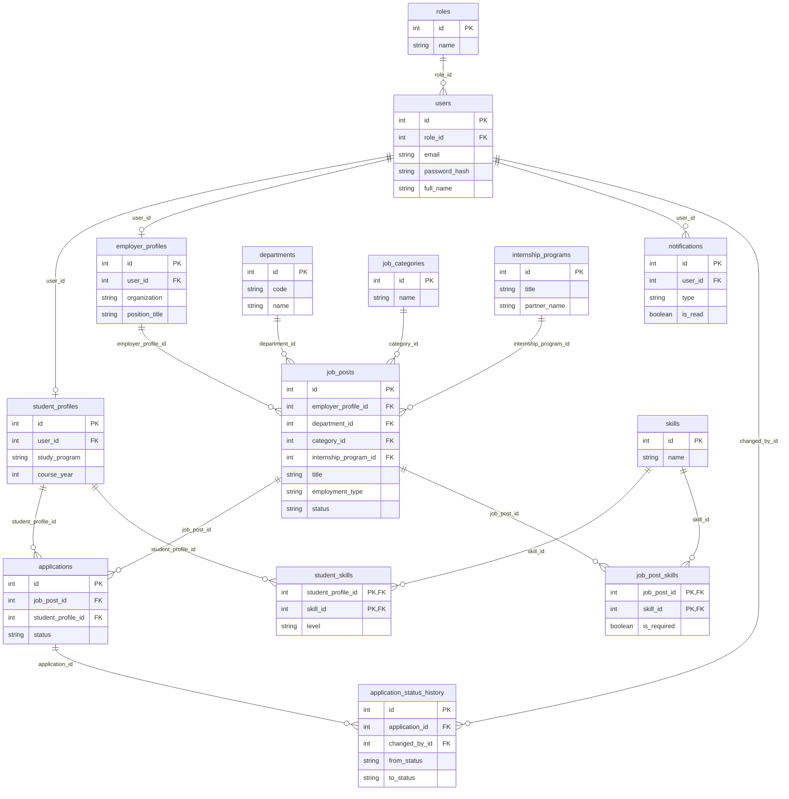

```mermaid
erDiagram
    roles ||--o{ users : "role_id"
    users ||--o| student_profiles : "user_id"
    users ||--o| employer_profiles : "user_id"
    users ||--o{ notifications : "user_id"
    users ||--o{ application_status_history : "changed_by_id"

    departments ||--o{ job_posts : "department_id"
    job_categories ||--o{ job_posts : "category_id"
    internship_programs ||--o{ job_posts : "internship_program_id"
    employer_profiles ||--o{ job_posts : "employer_profile_id"

    job_posts ||--o{ applications : "job_post_id"
    student_profiles ||--o{ applications : "student_profile_id"
    applications ||--o{ application_status_history : "application_id"

    skills ||--o{ student_skills : "skill_id"
    student_profiles ||--o{ student_skills : "student_profile_id"
    skills ||--o{ job_post_skills : "skill_id"
    job_posts ||--o{ job_post_skills : "job_post_id"

    roles {
        int id PK
        string name
    }
    users {
        int id PK
        int role_id FK
        string email
        string password_hash
        string full_name
    }
    student_profiles {
        int id PK
        int user_id FK
        string study_program
        int course_year
    }
    employer_profiles {
        int id PK
        int user_id FK
        string organization
        string position_title
    }
    departments {
        int id PK
        string code
        string name
    }
    job_categories {
        int id PK
        string name
    }
    internship_programs {
        int id PK
        string title
        string partner_name
    }
    job_posts {
        int id PK
        int employer_profile_id FK
        int department_id FK
        int category_id FK
        int internship_program_id FK
        string title
        string employment_type
        string status
    }
    applications {
        int id PK
        int job_post_id FK
        int student_profile_id FK
        string status
    }
    application_status_history {
        int id PK
        int application_id FK
        int changed_by_id FK
        string from_status
        string to_status
    }
    skills {
        int id PK
        string name
    }
    student_skills {
        int student_profile_id PK,FK
        int skill_id PK,FK
        string level
    }
    job_post_skills {
        int job_post_id PK,FK
        int skill_id PK,FK
        boolean is_required
    }
    notifications {
        int id PK
        int user_id FK
        string type
        boolean is_read
    }
```
